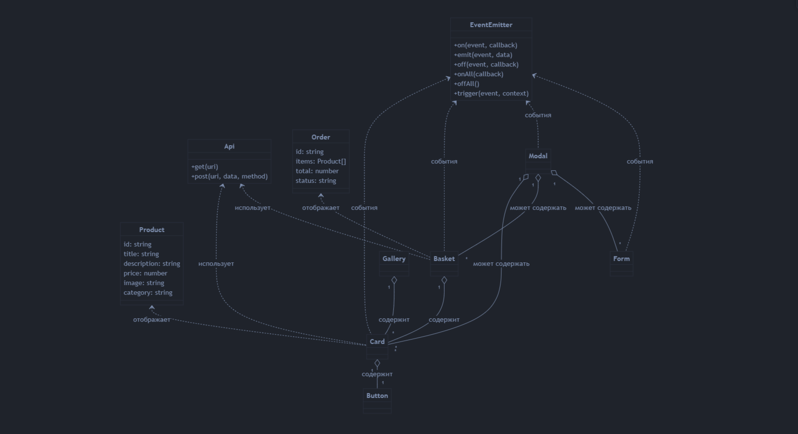

# Проектная работа "Веб-ларек"

Стек: HTML, SCSS, TS, Webpack

Структура проекта:
- src/ — исходные файлы проекта
- src/components/ — папка с JS компонентами
- src/components/base/ — папка с базовым кодом

Важные файлы:
- src/pages/index.html — HTML-файл главной страницы
- src/types/index.ts — файл с типами
- src/index.ts — точка входа приложения
- src/scss/styles.scss — корневой файл стилей
- src/utils/constants.ts — файл с константами
- src/utils/utils.ts — файл с утилитами

## Установка и запуск
Для установки и запуска проекта необходимо выполнить команды

```
npm install
npm run start
```

или

```
yarn
yarn start
```
## Сборка

```
npm run build
```

или

```
yarn build
```

## Архитектура приложения

### Используемый стек

- **Язык:** TypeScript
- **Сборка:** Webpack
- **Стили:** SCSS (БЭМ)
- **API:** REST (через переменную окружения `API_ORIGIN`)
- **Паттерн:** MV* (разделение на Модели, Вьюхи, EventEmitter)

### Базовые классы и их предназначение

- **Api**  
  Инкапсулирует работу с сервером. Реализует методы для получения и отправки данных (`get`, `post`). Использует базовый URL из переменной окружения.

- **EventEmitter**  
  Классический брокер событий. Позволяет подписываться на события, снимать обработчики, инициировать события, слушать все события или по шаблону.

### Основные компоненты и их функции

- **Card**  
  Отображает товар. Использует данные модели Product. Имеет модификаторы для разных режимов отображения (полная, компактная).

- **Basket**  
  Отображает корзину покупок. Взаимодействует с моделью заказа (Order).

- **Modal**  
  Универсальное модальное окно для отображения карточек, корзины, форм и сообщений.

- **Button**  
  Универсальная кнопка с модификаторами для разных состояний.

- **Form**  
  Компонент для ввода и отправки данных (например, оформления заказа).

- **Gallery**  
  Сетка для отображения списка товаров.

### Взаимодействие компонентов

- Пользователь взаимодействует с компонентами (например, нажимает кнопку).
- Компоненты через EventEmitter инициируют события.
- Контроллер/Presenter реагирует на события, обновляет модели.
- Модели через EventEmitter уведомляют вьюхи об изменениях.
- Вьюхи обновляют отображение.

### Типы данных

- **Product**: id, title, description, price, image, category
- **Order**: id, items, total, status

### Процессы

- Все основные процессы реализованы через события (EventEmitter).
- Для поиска и работы с DOM используются утилиты (`ensureElement`, `cloneTemplate`, `bem` и др.).
- Константы для API и CDN вынесены в отдельный модуль.

## UML-схема архитектуры


